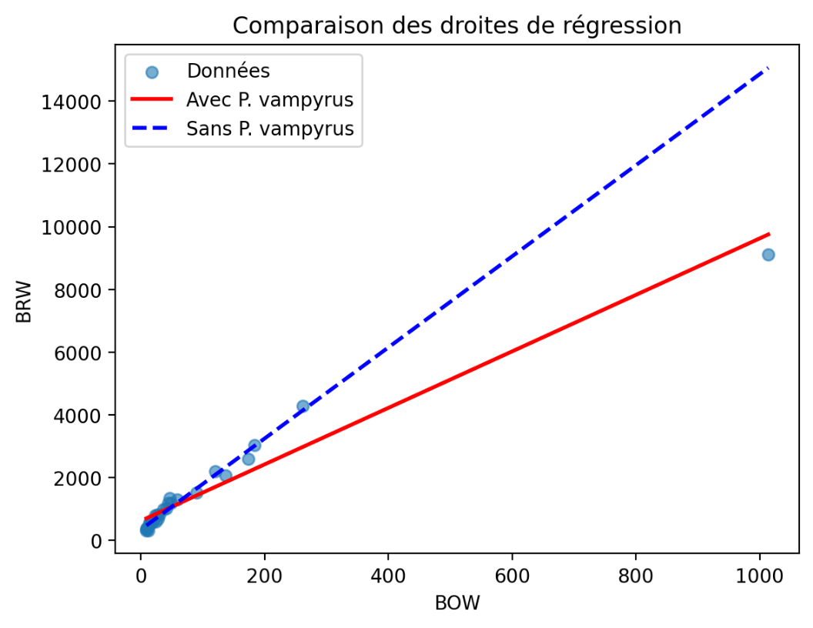
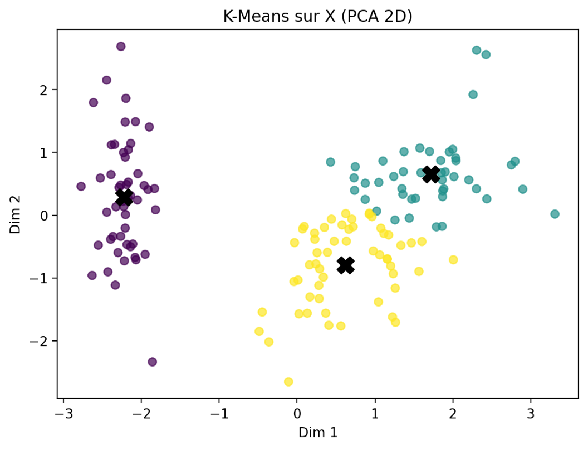

# Machine Learning — ECE Paris (2025/2026)

Projets réalisés dans les modules **Machine Learning 1** et **Machine Learning 2** du cycle ingénieur de l'ECE Paris (majeure Data & IA), pendant l'année 2025/2026.

Le dépôt couvre toute la chaîne d'un projet de machine learning : exploration et nettoyage des données, modèles statistiques, apprentissage supervisé et non supervisé, réseaux de neurones (MLP, rétropropagation codée à la main, RNN) et restitution des résultats dans des applications Streamlit.

Les deux applications Streamlit de ML1 sont **utilisables en ligne** sur Hugging Face (liens ▶ démo ci-dessous). Elles s'exécutent dans le navigateur, avec environ 1 minute de chargement.

**Stack :** Python · pandas · NumPy · scikit-learn · statsmodels · TensorFlow / Keras · Streamlit · Matplotlib / Seaborn

---

## Machine Learning 1

| Projet | Ce qui est fait | Résultat clé |
|---|---|---|
| [Régression linéaire : cerveau et masse corporelle des chauves-souris](machine-learning-1/regression-lineaire-chauves-souris) ([▶ démo](https://huggingface.co/spaces/edouardmnt04/regression-chauves-souris)) | Application Streamlit : régression linéaire (statsmodels), diagnostic des résidus, détection d'un point influent | R² = 0,95. Sans l'espèce atypique, la pente passe de 9,0 à 14,5 mg/g |
| [Clustering : Iris, exoplanètes et vins](machine-learning-1/clustering-iris-exoplanetes-vins) ([▶ démo](https://huggingface.co/spaces/edouardmnt04/clustering-iris-exoplanetes-vins)) | Application Streamlit : ACP, K-Means, CAH, indices CH / DB, puis pipeline complet sur Wine Quality (imputation, DBSCAN, KNN, arbre, régression logistique) | Silhouette 0,51 sur Iris. F1 = 0,76 pour prédire la qualité d'un vin |
| [Classification avec SVM](machine-learning-1/svm-classification/svm_classification.ipynb) | 4 jeux UCI : nettoyage, one-hot encoding, sélection de variables (chi²), validation croisée stratifiée, GridSearch sur noyau et `C` | 97 % (cancer du sein), 91 % (spam), 99,9 % (voitures), 100 % (champignons) |

<p align="center">
  
  
</p>

## Machine Learning 2

| Projet | Ce qui est fait | Résultat clé |
|---|---|---|
| [MLP avec Keras et scikit-learn](machine-learning-2/mlp-keras-chiffres-manuscrits/mlp_keras_digits.ipynb) | Réseau dense sur les chiffres manuscrits : taux d'apprentissage, SGD vs Adam, initialisation des poids, callbacks (EarlyStopping, ModelCheckpoint, TensorBoard) | 97 % en Keras, 98,5 % avec `MLPClassifier` |
| [Rétropropagation from scratch en NumPy](machine-learning-2/retropropagation-numpy/backpropagation_numpy.ipynb) | Softmax, entropie croisée, régression logistique et réseau à une couche cachée codés à la main, étude des activations, validation contre Keras | 96 % en NumPy. La loss manuelle est identique à celle de Keras |
| [RNN : génération de texte et analyse de sentiment](machine-learning-2/rnn-generation-texte-analyse-sentiment/rnn_texte_sentiment.ipynb) | GRU caractère par caractère sur Shakespeare, puis Embedding + GRU pour classer 50 000 critiques IMDB | 86 % d'accuracy sur 40 000 critiques de test |
| [Régression de la consommation automobile (TP noté)](machine-learning-2/regression-consommation-auto-keras/regression_auto_mpg_keras.ipynb) | Auto MPG : nettoyage, encodage, régression linéaire Keras vs réseau profond | R² = 0,90 et erreur moyenne de 1,6 MPG (contre 2,5 en linéaire) |

---

## Organisation du dépôt

```
.
├── machine-learning-1/
│   ├── regression-lineaire-chauves-souris/   # app Streamlit + données
│   ├── clustering-iris-exoplanetes-vins/     # app Streamlit + données
│   └── svm-classification/                   # notebook + 4 jeux de données UCI
└── machine-learning-2/
    ├── mlp-keras-chiffres-manuscrits/
    ├── retropropagation-numpy/
    ├── rnn-generation-texte-analyse-sentiment/
    └── regression-consommation-auto-keras/
```

## Lancer les projets

```bash
pip install -r requirements.txt

# Applications Streamlit
streamlit run machine-learning-1/regression-lineaire-chauves-souris/app.py
streamlit run machine-learning-1/clustering-iris-exoplanetes-vins/app.py

# Notebooks : à ouvrir depuis leur dossier (les chemins de données sont relatifs)
jupyter lab
```

Les jeux de données sont inclus, sauf pour le notebook RNN : `shakespeare.txt` (corpus *Tiny Shakespeare*) et `MovieReview.csv` (critiques IMDB), trop volumineux et fournis pendant le cours. Le notebook Auto MPG télécharge ses données directement depuis l'UCI.

## Auteurs

**Édouard Menut**. Les projets *Régression linéaire*, *Clustering* et le TP noté *Auto MPG* ont été réalisés en binôme avec **Chloé Lestic**.

Autres projets : [Data Science](https://github.com/Edouardmnt/ECE-Data-Science-2025-2026) · [CinéTarget, Naive Bayes](https://github.com/Edouardmnt/ECE-CineTarget-Naive-Bayes) · [Data Mining](https://github.com/Edouardmnt/ECE-Data-Mining-2025-2026) · [Big Data](https://github.com/Edouardmnt/ECE-Big-Data-2025-2026)
